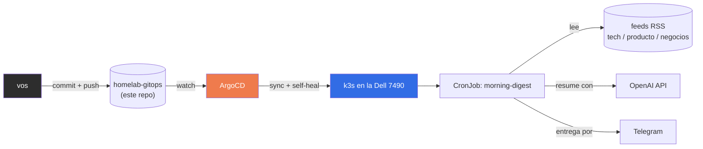

# homelab-gitops

> Una notebook que juntaba polvo con la batería fundida, convertida en un
> cluster Kubernetes gobernado 100% por Git. Nada se toca a mano en el
> cluster: si algo cambia, cambia acá, se hace commit, y ArgoCD lo aplica
> solo.

|  |  |
|---|---|
| **Hardware** | Dell Latitude 7490 (i5 8va gen, 16GB RAM, sin GPU, sin batería — vive enchufada) |
| **SO** | Debian 13, mínimo, sin entorno gráfico |
| **Orquestador** | k3s (un solo nodo) + ArgoCD (self-heal on) |
| **Regla de oro** | Los cerebros van por API (OpenAI/Claude), el fierro local solo orquesta |
| **Agentes corriendo** | 1 — `morning-digest` |

## El loop completo



Si alguien entra por SSH y edita algo con `kubectl` a mano, ArgoCD lo nota
y lo revierte. Ese es, literalmente, el punto de todo el ejercicio.

## Por qué existe esto

La 7490 tenía un problema simple: no arrancaba sin estar enchufada, y
estaba juntando polvo. Un server que vive enchufado 24/7 y no necesita
batería no es un defecto, es el caso de uso perfecto. La pregunta era qué
tan lejos se podía llevar esa máquina vieja como plataforma real de
aprendizaje — no un tutorial de juguete, sino la misma disciplina que usa
un equipo de infra en producción, comprimida en un solo nodo.

Un i5 de 8va gen con 16GB de RAM no compite con GPUs corriendo modelos
grandes, pero sobra y sobra para correr Kubernetes, ArgoCD, y agentes que
llaman a un LLM por HTTP y se apagan. Pelear esa batalla al revés (LLM
pesado local, orquestación mínima) hubiera sido jugar en contra del
hardware que hay.

## Qué hay corriendo acá

| Componente | Para qué |
|---|---|
| **k3s** | Kubernetes de un solo nodo, liviano, con Traefik y SQLite incluidos. Nada de etcd ni HA — no hace falta para un nodo. |
| **ArgoCD** | El corazón operativo. Vigila este repo y aplica cualquier cambio al cluster automáticamente, con self-heal activado. |
| **`agents/morning-digest`** | El primer agente real: un CronJob diario que lee feeds RSS (tech, producto, negocios), arma un resumen con OpenAI agrupado por tema, y lo manda por Telegram con formato (negritas, bullets, link a cada noticia). Corre, resume, se apaga — nada queda vivo consumiendo RAM entre corrida y corrida. |

## Cómo se armó, en orden real

<details>
<summary><b>1. El sistema operativo</b> — por qué Debian y no otra cosa</summary>

Instalación mínima, sin entorno gráfico. Se evaluaron Ubuntu Server (de
más, con snapd y capas que no aportan nada acá), Fedora/openSUSE (ciclos
de release demasiado cortos para un server que se quiere dejar tranquilo)
y Arch (rolling release en una máquina desatendida es jugarse a que un
update rompa algo mientras dormís). Debian gana por aburrido, que es
exactamente lo que se necesita.
</details>

<details>
<summary><b>2. Acceso remoto, hecho bien</b> — SSH solo por clave</summary>

Se generó un par de claves ed25519 en el desktop, se copió la pública al
server, y recién después de confirmar que el login sin password
funcionaba se deshabilitó `PasswordAuthentication` — con dos terminales
abiertas en paralelo por las dudas, porque quedarse afuera de tu propio
server por un typo en `sshd_config` es un clásico.

También apareció el caso menos obvio: `UsePAM yes` puede dejar un bypass
de password vía `KbdInteractiveAuthentication` aunque
`PasswordAuthentication` esté en `no`. Se verificó explícitamente con
`ssh -o PubkeyAuthentication=no` para confirmar que de verdad rechazaba
sin clave.
</details>

<details>
<summary><b>3. Red, con IP que no se mueve</b></summary>

La 7490 arrancó por WiFi (funcional, pero no lo que se quiere para un
server 24/7), y después se le conectó un cable Ethernet. La interfaz
`enp0s31f6` no traía `dhclient` preinstalado en Debian 13 — se resolvió
con `isc-dhcp-client` — y se dejó la configuración persistente en
`/etc/network/interfaces` para que levante sola en cada boot. La IP quedó
reservada por MAC en el router (`Pre-assigned DHCP IP Addresses`), así la
dirección nunca cambia aunque el DHCP reinicie.
</details>

<details>
<summary><b>4. k3s y ArgoCD, en ese orden, desde el primer día</b></summary>

La tentación natural es instalar Kubernetes y empezar a tirar
`kubectl apply` a mano mientras "se prueban cosas". Se evitó eso a
propósito: ArgoCD se instaló antes del primer Deployment real, para que
el hábito de "todo pasa por Git" quedara fijado desde el arranque y no
como una migración incómoda después.

El primer test fue un nginx dummy — no porque nginx importe, sino para
confirmar el ciclo completo: commit → push → ArgoCD sincroniza →
`kubectl delete pod` a mano → el pod vuelve solo.
</details>

<details>
<summary><b>5. El primer agente real</b> — decisiones de diseño</summary>

Reemplazar el nginx de prueba por algo que efectivamente hace algo útil:
leer feeds, resumir con un LLM, mandar el resultado a Telegram.

- **Secrets fuera de Git.** Se evaluó SOPS+KSOPS para manejar secrets
  encriptados dentro del repo, pero para un solo CronJob con un puñado de
  variables es sobreingeniería. Se optó por crear el `Secret` de
  Kubernetes directo con `kubectl`, mientras el CronJob (que sí vive en
  Git) lo referencia por nombre. GitOps parcial, pragmático. Cuando haya
  tres o cuatro agentes con secrets distintos, ahí se justifica meter
  SOPS de una.
- **Build manual, no CI todavía.** La imagen se buildea a mano y se
  pushea a GitHub Container Registry. Suficiente para un agente. Cuando
  el ciclo de iterar-rebuildear-pushear empiece a cansar, se migra a
  GitHub Actions.
- **Gmail como fuente, probado y descartado.** La primera versión sumaba
  newsletters etiquetados en Gmail vía IMAP, pero el label de Gmail se
  trataba como si fuera literalmente una carpeta IMAP (`imap.select`),
  algo que no funciona en general para labels anidados. En vez de meterle
  la extensión `X-GM-LABELS` de Gmail para arreglarlo bien, se sacó la
  fuente entera — RSS solo, más feeds, resumen más largo y con links.
</details>

## Los baches, porque son la parte que vale la pena releer

Nada de esto salió andando a la primera, y está bien que así sea:

| Bache | Qué pasó en realidad | Cómo se resolvió |
|---|---|---|
| **CRD de ArgoCD no aplicaba** | `kubectl apply` excedía el límite de 256KB de la annotation `last-applied-configuration`. | `--server-side --force-conflicts`, que no depende de esa annotation. |
| **`k3s kubectl` ignoraba `~/.kube/config`** | A diferencia de `kubectl` normal, iba directo a `/etc/rancher/k3s/k3s.yaml` (permisos solo root). | Exportar `KUBECONFIG` explícitamente antes de cada comando. |
| **`openai==1.54.0` tiraba `TypeError` sobre `proxies`** | `httpx` no estaba pinneado, `pip` instaló la última versión, que había sacado ese parámetro interno. | Pinnear `httpx==0.27.2`. Recordatorio permanente: pinnear versiones, siempre. |
| **El job corría `Completed`, exit 0, pero no llegaba nada a Telegram** | El script ignoraba silenciosamente cualquier error de la API de Telegram. Al agregar logging + `raise_for_status()`, apareció el problema real: el token tenía el prefijo `bot` duplicado (`botbot123:...`), tal cual lo entrega BotFather si lo copiás del mensaje de confirmación. | Se corrigió el dato **y** el código ahora tolera el prefijo con `.removeprefix("bot")`, para que el mismo error humano no vuelva a romper nada. |
| **La fuente de Gmail "andaba" pero no traía nada útil** | El label se resolvía como carpeta IMAP literal, sin verificar si el `select` había funcionado — fallaba en silencio. | Se sacó la fuente en vez de arreglar el lookup: RSS ya cubre el caso de uso mejor. |

Ninguno de estos errores fue exótico. Son los errores normales de armar
infraestructura real: límites de API mal documentados, defaults de
herramientas que cambian entre versiones, y un copy-paste de token con un
prefijo de más. La diferencia entre que esto ande o no es tener logging
que efectivamente diga qué pasó, en vez de asumir que "no tiró error"
significa "funcionó".

## Estructura del repo

```
homelab-gitops/
├── apps/                     # reservado para el patrón app-of-apps a futuro
├── agents/
│   └── morning-digest/
│       ├── src/
│       │   ├── agent.py
│       │   └── requirements.txt
│       ├── Dockerfile
│       ├── feeds.yaml
│       ├── cronjob.yaml
│       └── kustomization.yaml
└── infra/                    # reservado para observabilidad (Phoenix/VictoriaMetrics) a futuro
```

## Qué sigue

- [x] Timezone del sistema fijado a `America/Argentina/Buenos_Aires` para
      que el CronJob dispare a la hora real esperada, no en UTC.
- [x] Observabilidad (`infra/phoenix`, `infra/victoria-metrics`,
      `infra/node-exporter`): tracing de cada corrida de agente
      (Phoenix), métricas de costo/heartbeat por agente y salud del
      node (VictoriaMetrics), todo fail-open — si la telemetría está
      caída, el agente entrega igual. Detalle completo en
      `docs/superpowers/specs/2026-07-23-telemetria-design.md`.
- [ ] Más agentes bajo `agents/`, cada uno con su propia carpeta,
      Dockerfile, y CronJob — el patrón ya está probado y se repite.
