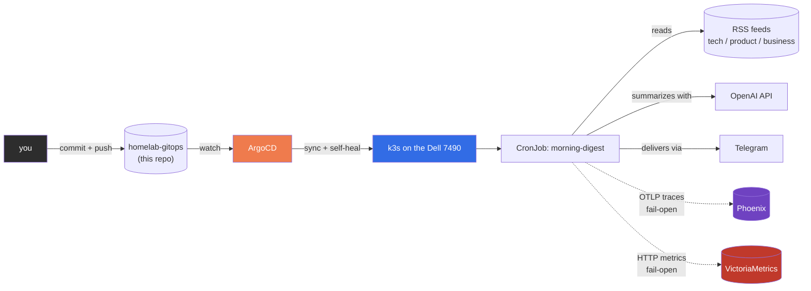
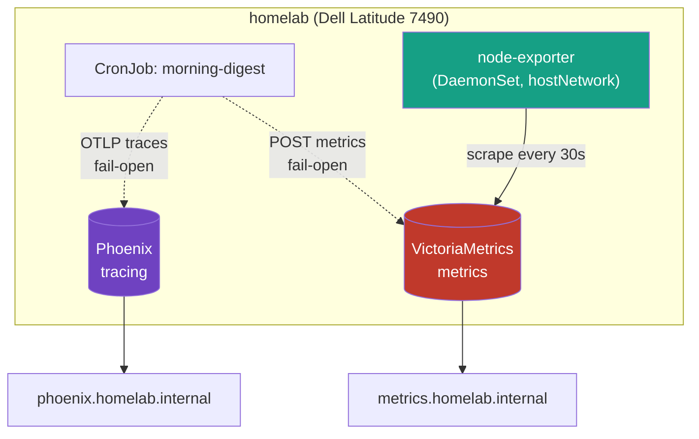

# homelab-gitops

> A laptop that was gathering dust with a dead battery, turned into a
> Kubernetes cluster 100% governed by Git. Nothing gets touched by hand
> on the cluster: if something changes, it changes here, gets committed,
> and ArgoCD applies it automatically.

|  |  |
|---|---|
| **Hardware** | Dell Latitude 7490 (8th-gen i5, 16GB RAM, no GPU, no battery — lives plugged in) |
| **OS** | Debian 13, minimal, no desktop environment |
| **Orchestrator** | k3s (single node) + ArgoCD (self-heal on) |
| **Golden rule** | The brains go over the API (OpenAI/Claude), the local iron only orchestrates |
| **Agents running** | 4 — `morning-digest`, `outreach-bot`, `watchdog`, `metrics-snapshot` |
| **Observability** | Phoenix (tracing) + VictoriaMetrics (metrics) + node-exporter (node health) — all three, fail-open |
| **Network** | Pi-hole — DNS for the whole LAN, with network-level ad/tracking blocking |
| **Remote access** | Tailscale (WireGuard mesh) — homelab, desktop, and phone on the same tailnet, SSH without exposing ports on the router |

## The full loop


```mermaid
flowchart LR
    Dev["you"] -->|commit + push| Repo[("homelab-gitops\n(this repo)")]
    Repo -->|watch| ArgoCD
    ArgoCD -->|sync + self-heal| K3s["k3s on the Dell 7490"]
    K3s --> Cron["CronJob: morning-digest"]
    Cron -->|reads| RSS[("RSS feeds\ntech / product / business")]
    Cron -->|summarizes with| LLM["OpenAI API"]
    Cron -->|delivers via| TG["Telegram"]
    Cron -.->|OTLP traces\nfail-open| Phoenix[("Phoenix")]
    Cron -.->|HTTP metrics\nfail-open| VM[("VictoriaMetrics")]

    style Dev fill:#2d2d2d,color:#fff
    style ArgoCD fill:#ef7b4d,color:#fff
    style K3s fill:#326ce5,color:#fff
    style Phoenix fill:#6f42c1,color:#fff
    style VM fill:#c0392b,color:#fff
```

If someone SSHes in and edits something by hand with `kubectl`, ArgoCD
notices and reverts it. That is, literally, the whole point of this
exercise.

## Why this exists

The 7490 had a simple problem: it wouldn't boot without being plugged in,
and it was gathering dust. A server that lives plugged in 24/7 and
doesn't need a battery isn't a defect, it's the perfect use case. The
question was how far that old machine could be pushed as a real learning
platform — not a toy tutorial, but the same discipline an infra team
uses in production, compressed into a single node.

An 8th-gen i5 with 16GB of RAM doesn't compete with GPUs running large
models, but it's more than enough to run Kubernetes, ArgoCD, and agents
that call an LLM over HTTP and shut down. Fighting that battle the other
way around (heavy local LLM, minimal orchestration) would have meant
fighting against the hardware on hand.

## What's running here

| Component | What it's for |
|---|---|
| **k3s** | Single-node, lightweight Kubernetes, with Traefik and SQLite included. No etcd, no HA — not needed for one node. |
| **ArgoCD** | The operational heart. Watches this repo and applies any change to the cluster automatically, with self-heal enabled. |
| **`agents/morning-digest`** | The first real agent: a daily CronJob that reads RSS feeds (tech, product, business), builds a summary with OpenAI grouped by topic, and sends it via Telegram with formatting (bold, bullets, a link per item). It also publishes those same items to [`digest-agent`](https://digest-agent.vercel.app) (an Eve agent on Vercel), which serves them to the [portfolio](https://github.com/julianalvarez95/portfolio-personal) — fail-open, same as tracing/metrics: if digest-agent is down it doesn't affect delivery via Telegram. Runs, summarizes, shuts down — nothing stays alive consuming RAM between runs. |
| **`agents/watchdog`** | The second agent: a CronJob every 10 minutes that evaluates alert rules (disk, memory, load, `morning-digest` health) against VictoriaMetrics and notifies via Telegram only on real state changes — no LLM, with its own state machine (pending → firing, hysteresis, dedup) to avoid spamming. |
| **`agents/outreach-bot`** | Legal outreach over WhatsApp via Kapso: a CronJob (`outreach-bot-sender`, weekdays 9am) sends messages sourced from Google Sheets, backed by a persistent `outreach-bot-webhook` Deployment (FastAPI/uvicorn) exposed through a Cloudflare Tunnel to receive replies. Design docs and rollout status live in [`outreach-bot-docs`](https://github.com/julianalvarez95/outreach-bot-docs) (private). |
| **`agents/metrics-snapshot`** | A CronJob every 15 minutes that queries VictoriaMetrics for every other agent's health (last run timestamp, success, duration), 30-day LLM token usage, `watchdog`'s current alert states, and `outreach-bot` contact counts, bundles it into one snapshot, and publishes it to the public [agent-metrics dashboard](https://agent-metrics-dashboard-mu.vercel.app) via `POST /api/ingest`. Fail-open on that publish step, same as tracing/metrics elsewhere: if the dashboard ingest fails it's logged and swallowed, and the run still reports its own success/duration/heartbeat back to VictoriaMetrics like every other agent. |
| **`infra/phoenix`** | Tracing for every agent run: RSS fetch → OpenAI call (with tokens) → Telegram delivery, as a single navigable end-to-end trace. |
| **`infra/victoria-metrics`** | Cost metrics (tokens), duration, and heartbeat per agent, plus node health scraping. Short retention (10 days), sized for the ~12Gi of free disk the 7490 has. |
| **`infra/node-exporter`** | Lightweight DaemonSet exposing the node's CPU/memory/disk so VictoriaMetrics can scrape them every 30s — before this, the only way to see those numbers was `kubectl top`, with no history. |
| **`infra/pihole`** | DNS for the whole LAN: the router hands out this IP as DNS via DHCP, and Pi-hole filters ads/tracking before forwarding to public resolvers (`1.1.1.1`, `9.9.9.9` — never the router, to avoid creating a loop). DNS only, no DHCP of its own — the router still assigns IPs. |

Both observability UIs (Phoenix and VictoriaMetrics' `vmui`) plus the
Pi-hole panel sit behind a Traefik `IngressRoute`, resolved only within
the home LAN (`phoenix.homelab.internal`, `metrics.homelab.internal`,
`pihole.homelab.internal`) — no public exposure, no TLS or auth of their
own, same trust model as the rest of the cluster. The exception is
Pi-hole's own port 53, which does need to reach the whole LAN (not just
the cluster): it's exposed via `hostPort` on the Deployment instead of
`hostNetwork`, because k3s already uses the node's 80/443 for Traefik
and there's no MetalLB on this cluster.

Once Pi-hole is the LAN's resolver, its "Local DNS Records" can serve
the `*.homelab.internal` names above directly — today each machine on
the LAN resolves them via a manual `/etc/hosts` entry, a hack Pi-hole
can retire.


```mermaid
flowchart TB
    subgraph Node["homelab (Dell Latitude 7490)"]
        Cron["CronJob: morning-digest"]
        NodeExp["node-exporter\n(DaemonSet, hostNetwork)"]
        Phoenix[("Phoenix\ntracing")]
        VM[("VictoriaMetrics\nmetrics")]
    end

    Cron -.->|OTLP traces\nfail-open| Phoenix
    Cron -.->|POST metrics\nfail-open| VM
    NodeExp -->|scrape every 30s| VM

    Phoenix --> PhoenixWeb["phoenix.homelab.internal"]
    VM --> VMWeb["metrics.homelab.internal"]

    style Phoenix fill:#6f42c1,color:#fff
    style VM fill:#c0392b,color:#fff
    style NodeExp fill:#16a085,color:#fff
```

The dashed lines are intentional: if Phoenix or VictoriaMetrics are
down, the agent logs the error and continues — digest delivery never
depends on telemetry being up.

## How it was built, in the actual order

<details>
<summary><b>1. The operating system</b> — why Debian and not something else</summary>

Minimal install, no desktop environment. Ubuntu Server was considered
(too much, with snapd and layers that add nothing here), Fedora/openSUSE
(release cycles too short for a server meant to be left alone), and
Arch (rolling release on an unattended machine is a bet that an update
breaks something while you're asleep). Debian wins by being boring,
which is exactly what's needed here.
</details>

<details>
<summary><b>2. Remote access, done right</b> — SSH by key only</summary>

An ed25519 key pair was generated on the desktop, the public key copied
to the server, and only after confirming password-less login worked was
`PasswordAuthentication` disabled — with two terminals open in parallel
just in case, because locking yourself out of your own server over a
typo in `sshd_config` is a classic mistake.

A less obvious case also showed up: `UsePAM yes` can leave a password
bypass via `KbdInteractiveAuthentication` even when
`PasswordAuthentication` is `no`. This was explicitly verified with
`ssh -o PubkeyAuthentication=no` to confirm it really did reject
connections without a key.
</details>

<details>
<summary><b>3. Networking, with an IP that doesn't move</b></summary>

The 7490 booted over WiFi at first (functional, but not what you want
for a 24/7 server), and an Ethernet cable was connected afterward. The
`enp0s31f6` interface didn't come with `dhclient` preinstalled on
Debian 13 — solved with `isc-dhcp-client` — and the config was made
persistent in `/etc/network/interfaces` so it comes up on its own on
every boot. The IP was reserved by MAC on the router
(`Pre-assigned DHCP IP Addresses`), so the address never changes even if
the DHCP server restarts.
</details>

<details>
<summary><b>4. k3s and ArgoCD, in that order, from day one</b></summary>

The natural temptation is to install Kubernetes and start throwing
`kubectl apply` by hand "while trying things out." That was avoided on
purpose: ArgoCD was installed before the first real Deployment, so the
habit of "everything goes through Git" would be set from the start
instead of being an awkward migration later.

The first test was a dummy nginx — not because nginx matters, but to
confirm the full cycle: commit → push → ArgoCD syncs → `kubectl delete
pod` by hand → the pod comes back on its own.
</details>

<details>
<summary><b>5. The first real agent</b> — design decisions</summary>

Replacing the test nginx with something that actually does something
useful: read feeds, summarize with an LLM, send the result to Telegram.

- **Secrets kept out of Git.** SOPS+KSOPS was considered for handling
  encrypted secrets inside the repo, but for a single CronJob with a
  handful of variables that's over-engineering. The choice was to
  create the Kubernetes `Secret` directly with `kubectl`, while the
  CronJob (which does live in Git) references it by name. Partial,
  pragmatic GitOps. Once there are three or four agents with different
  secrets, that's when SOPS earns its keep.
- **Manual build, no CI yet.** The image is built by hand and pushed to
  the GitHub Container Registry. Enough for one agent. Once the
  iterate-rebuild-push cycle starts getting old, it migrates to GitHub
  Actions.
- **Gmail as a source, tried and dropped.** The first version pulled in
  newsletters labeled in Gmail via IMAP, but the Gmail label was treated
  as if it were literally an IMAP folder (`imap.select`), which doesn't
  generally work for nested labels. Rather than reaching for Gmail's
  `X-GM-LABELS` extension to fix it properly, the source was dropped
  entirely — RSS only, more feeds, a longer summary with links.
</details>

<details>
<summary><b>6. Observability, in 3 phases</b> — tracing, metrics, and node health</summary>

With a single agent in production, the only way to see what was
happening on each run was reading Kubernetes logs by hand — and there
had already been a real incident (the one below: the job finished
`Completed`, exit 0, without sending anything to Telegram). Before
touching code, a design doc was written
(`docs/superpowers/specs/2026-07-23-telemetria-design.md`), in 3 phases
in decreasing priority: agent debugging, LLM cost, node health.

**Architecture: direct dual-write, no collector.** An OTel Collector as
a central hub was considered, but that adds one more persistent service
on a node that's already tight on disk (12Gi free). Each agent exports
directly to Phoenix (traces) and VictoriaMetrics (metrics) at the end
of its run — consistent with this repo's golden rule: the local
hardware only orchestrates, nothing runs extra.

**Phase 1 — Phoenix.** The OpenAI client gets auto-instrumented via
OpenInference (prompt/completion tokens included for free), plus manual
spans for the RSS fetch and the Telegram delivery, all nested under one
root span per run — so a full run is one navigable end-to-end trace,
not 3 loose traces. Non-negotiable rule: telemetry has to fail open —
if Phoenix is down, the error gets logged and the digest still gets
sent.

**Phase 2 — VictoriaMetrics.** At the end of each run, the agent reports
success/failure, duration, tokens used, and a heartbeat timestamp. The
detail that matters: the success report lives in a `try/finally` that
wraps the *entire* run, not just the happy path — otherwise the success
metric could never register a real failure, which is exactly what it
exists for.

**Phase 3 — node-exporter.** Lightweight DaemonSet, no PVC of its own,
scraped by VictoriaMetrics every 30 seconds. The pattern flips here:
instead of the agent pushing data (as in Phases 1 and 2), it's
VictoriaMetrics that goes and fetches it — because node-exporter is a
persistent process, not an ephemeral CronJob.
</details>

<details>
<summary><b>7. Pi-hole</b> — DNS for the whole LAN, not just the cluster</summary>

Up to this point everything running on the cluster was only consumed
from within the LAN via `IngressRoute` — but DNS is different: it has
to reach *every* device on the network, not just whoever points at a
`*.homelab.internal` hostname.

**Why `hostPort` and not `hostNetwork`.** k3s already uses the node's
80/443 for Traefik, and there's no MetalLB on this cluster (no
`LoadBalancer` Service anywhere in the repo). With `hostNetwork: true`
the Pi-hole pod would inherit the node's entire network and its web
panel (port 80) would collide with Traefik. The fix was to expose
*only* port 53 (TCP+UDP) to the host via `hostPort` on the Deployment,
leaving the web panel as just another service in the repo: ClusterIP +
`IngressRoute`.

**Never the router as upstream.** `FTLCONF_dns_upstreams` points
directly at `1.1.1.1`/`9.9.9.9`. Pointing at the router would have
closed a loop (router → Pi-hole → router) that takes down DNS
resolution for the whole house the moment anyone tries it.

Two real bugs only showed up when testing from another device on the
LAN (see the bug table below): `ufw` blocking forwarded traffic
(`FORWARD`, not `INPUT`) toward the pod, and FTL ignoring queries that
didn't come from the CNI's own subnet. Neither shows up testing from the
node itself — you need a second device on the LAN to see them.

**Verified end-to-end:** with the router (Technicolor DPC3848VE)
handing out `192.168.0.214` as DNS via DHCP, a real device on the LAN
resolves normal domains and blocks known tracking domains
(`doubleclick.net` → `0.0.0.0`). The Pi-hole dashboard shows distinct
client IPs per device instead of one generic IP — confirming that
`hostPort` isn't masking the real origin of the queries.
</details>

<details>
<summary><b>8. The second agent: watchdog</b> — proactive alerts, not a chatbot</summary>

With one agent (`morning-digest`) and full observability in place, the
natural question was what to do with the rest of the 7490. A
conversational bot and RAG were both ruled out for not adding any new
discipline; a **watchdog** was chosen instead: an agent that watches the
metrics that already exist and only notifies via Telegram when
something really changes state — the explicit goal was to learn real
alerting (thresholds, hysteresis, deduplication, avoiding spam), not
just move data from one place to another.

- **A CronJob with its own state machine, not vmalert+Alertmanager.** A
  standard stack would have solved this with less code, but it would
  also have hidden exactly the part that was meant to be learned.
  vmalert+Alertmanager remains a future graduation path once the number
  of rules grows (~8-10).
- **No LLM.** The text of each alert is a fixed template per rule —
  deterministic, nothing that can fail or hallucinate right when
  everything else is already broken. "Watchdog" watches the LLM agent
  (`morning-digest`), it doesn't call one.
- **State in VictoriaMetrics, not a new PVC.** Reuses existing infra
  (disk is the tightest constraint on the node) and gets free alert
  history charts in `vmui` as a bonus.
- **Three states per rule:** `0` inactive, `1` pending (condition true
  but not yet confirmed), `2` firing. Going from `1` to `2` requires the
  condition to still be true on the next run (`for_seconds`, ~10 min for
  the disk/memory/load rules) — that's the hysteresis, to avoid
  alerting on a one-second spike. While the state stays at `2` it
  doesn't notify again (the dedup), and if it never made it past `1`
  the resolution is silent: nothing had been alerted, so there's
  nothing to resolve out loud either.
- **Fail-closed reads, fail-open writes.** If pushing a metric fails, it
  gets logged and the agent moves on (same rule as the rest of the
  repo). But if reading a rule's previous state fails, that rule skips
  that entire run instead of assuming "inactive" — assuming inactive
  while VictoriaMetrics is down would turn that outage itself into a
  burst of false positives, exactly the spam this agent exists to
  avoid.
- **Telegram/metrics code duplicated on purpose, not shared.**
  `watchdog` copies `send_telegram`, `sanitize_telegram_html`, and
  `push_metrics` almost verbatim from `morning-digest` instead of
  extracting a shared module — two agents don't justify that layer. The
  trigger for extracting `agents/_shared/` is left for the third agent,
  documented in `CLAUDE.md`.

Verified live against the real cluster: the `disk_low` threshold was
forced to an absurd value, manual runs were triggered, and the full
sequence `0 → 1 → 2 (FIRING, a single message) → 2 (no re-notify) → 0
(RESOLVED)` was confirmed in Telegram and in the `vmui` charts, before
reverting the threshold to its real value.
</details>

<details>
<summary><b>9. Tailscale</b> — remote access between homelab, desktop, and phone, without exposing anything on the router</summary>

Up to this point, access to the 7490 depended on being on the same LAN
(SSH over a local IP) or exposing ports on the router — neither scales
well for connecting the desktop and phone from outside the house.
Tailscale sets up a WireGuard mesh between the three devices, each with
a fixed IP on `100.64.0.0/10` (CGNAT), without opening anything toward
the internet.

**Verified before installing: no conflict with Pi-hole.** Pi-hole runs
in the cluster, not as a native host service — the `Deployment` exposes
port 53 via `hostPort` (see section 7), which Kubernetes implements as
iptables DNAT, not a real host socket. `ss -tuln | grep :53` shows no
process listening at the host level, so the homelab's `tailscaled`
doesn't compete for the port. As a bonus, Tailscale adds one more
interface (`tailscale0`) through which Pi-hole could eventually also
serve DNS to remote devices — still pending a decision on whether to
point the tailnet's "Global nameserver" at the homelab's Tailscale IP.

**Installation, the same on all three Linux/homelab and desktop
machines:**

```bash
curl -fsSL https://tailscale.com/install.sh | sh
sudo tailscale up --ssh
```

`--ssh` enables Tailscale's native SSH (authenticated by tailnet
identity, not by key), in addition to the key-based SSH that already
existed (section 2) — it doesn't replace it. On the phone it was just
installing the official App Store app and logging in with the same
account.

**MagicDNS**, enabled afterward from the admin panel
(`login.tailscale.com/admin/dns`), resolves each device's name without
touching anything on the machines: `ssh usainbot@homelab` instead of
`ssh usainbot@100.102.169.46`.
</details>

## The bumps, because they're the part worth re-reading

None of this worked on the first try, and that's fine:

| Bump | What actually happened | How it got fixed |
|---|---|---|
| **ArgoCD's CRD wouldn't apply** | `kubectl apply` exceeded the 256KB limit of the `last-applied-configuration` annotation. | `--server-side --force-conflicts`, which doesn't depend on that annotation. |
| **`k3s kubectl` ignored `~/.kube/config`** | Unlike regular `kubectl`, it went straight to `/etc/rancher/k3s/k3s.yaml` (root-only permissions). | Export `KUBECONFIG` explicitly before every command. |
| **`openai==1.54.0` raised a `TypeError` about `proxies`** | `httpx` wasn't pinned, `pip` installed the latest version, which had dropped that internal parameter. | Pin `httpx==0.27.2`. Permanent reminder: always pin versions. |
| **The job ran `Completed`, exit 0, but nothing reached Telegram** | The script silently swallowed any error from the Telegram API. After adding logging + `raise_for_status()`, the real problem showed up: the token had the `bot` prefix duplicated (`botbot123:...`), exactly as BotFather hands it over if you copy it from the confirmation message. | Fixed the data **and** the code now tolerates the prefix with `.removeprefix("bot")`, so the same human error can't break it again. |
| **The Gmail source "worked" but brought back nothing useful** | The label was resolved as a literal IMAP folder, without checking whether the `select` had actually succeeded — it failed silently. | The source was dropped instead of fixing the lookup: RSS already covers the use case better. |
| **The OpenAI instrumenter demanded a much newer version** | `openinference-instrumentation-openai` requires `openai>=1.69.0` even in its oldest releases — the repo had `openai==1.54.0` pinned since the `httpx` incident above. | Bump `openai` to `1.99.9` (same major version, without jumping to SDK v2) and revalidate that `httpx==0.27.2` was still compatible before closing out the change. |
| **The instrumenter crashed with a `TypeError` from `wrap_function_wrapper`** | Unpinned `wrapt` resolved to version 2.x, which changed the signature `openinference-instrumentation-openai==0.1.40` expected. | Pin `wrapt==1.17.3`. |
| **`PHOENIX_COLLECTOR_ENDPOINT` built a broken URL** | Without the explicit `http://` scheme, Phoenix couldn't infer the transport protocol and silently fell back to HTTP with a malformed URL, instead of gRPC. | Always `http://host:4317`, even though the actual transport is gRPC. |
| **The Phoenix pod crashed on startup** | Kubernetes automatically injects a `PHOENIX_PORT="tcp://<ip>:6006"` env var into any pod in the namespace as soon as a Service named `phoenix` exists — and Phoenix expects that variable to be an integer, not that string. | Set `PHOENIX_PORT` and `PHOENIX_GRPC_PORT` explicitly in the Deployment, overriding the auto-generated value. |
| **The Phoenix UI wasn't reachable from another machine on the LAN** | `ufw` has a `DROP` default policy and only explicitly allowed a handful of ports (SSH, 6443, 80, 443, 8080) — the port-forwarded 6006 wasn't on the list. | Solved at the root with Traefik's `IngressRoute` over port 80 (already allowed), instead of opening a new port for every UI. |
| **An RSS feed dropped the connection mid-run** | A real `RemoteDisconnected` — the first failure the new tracing caught in production, visible as a span with `status_code: ERROR` and the full stack trace in Phoenix, instead of getting lost in Kubernetes logs. | Left unfixed on purpose: it stands as the first real case proving why tracing is worth having from day one. |
| **VictoriaMetrics "looks empty" most of the day** | With just one sample per daily run, instant queries (including the one `vmui` uses by default) fall outside the ~5-minute lookback and return "no data," even though the series exists. | Not a bug: use a range query (last 7 days) or `last_over_time(metric[25h])`. |
| **Pi-hole wasn't resolving anything from another device on the LAN** | The `hostPort` DNAT traffic (host → pod) goes through the `FORWARD` iptables chain, not `INPUT` — `ufw allow 53/tcp` and `ufw allow 53/udp` weren't enough because those rules only cover `INPUT`. `DEFAULT_FORWARD_POLICY="DROP"` in `/etc/default/ufw` dropped everything. | `DEFAULT_FORWARD_POLICY="ACCEPT"` + `ufw reload`. Acceptable on a single-cluster node with nothing else routing behind it. |
| **Pi-hole still wasn't responding after fixing `ufw`** | `dig` straight to the pod's IP worked, but from the LAN it still timed out. The FTL log said it plainly: `dnsmasq: ignoring query from non-local network 192.168.0.214` — the default `listeningMode` (`LOCAL`) only responds to sources the pod's own interface recognizes as local (the CNI subnet), not the real LAN arriving via `hostPort`. | `FTLCONF_dns_listeningMode=ALL`. Acceptable because Pi-hole has no public exposure, LAN only. |
| **`watchdog` sent a duplicate FIRING while testing the state machine** | Two manual runs triggered ~15-17s apart (much closer together than the real 10-min schedule) landed inside VictoriaMetrics' `-search.latencyOffset` (~30s): the second run read the state *before* the first one had written it. Not a bug in the state logic. | Nothing to fix in the code — at the real `*/10 * * * *` cadence the window doesn't apply. Documented in `CLAUDE.md` so the scare doesn't repeat from manual testing. |
| **`tailscale up --ssh` hung without showing the login URL on the desktop** | `tailscaled` kept retrying `bootstrapDNS` against several DERP hosts without progress. `resolvectl status` showed Cloudflare WARP holding the `+DefaultRoute` DNS scope with a local stub (`127.0.2.2`/`127.0.2.3`), and `dig login.tailscale.com` returned `192.200.0.x` IPs — synthetic fake-IPs from WARP, not Tailscale's real control-plane IP. | `warp-cli disconnect` before `tailscale up --ssh`. To run both at once in the future, exclude Tailscale's CGNAT range from the WARP tunnel: `warp-cli tunnel host add 100.64.0.0/10`. |

None of these errors were exotic. They're the normal errors of building
real infrastructure: poorly documented API limits, tool defaults that
change between versions, and a copy-pasted token with an extra prefix.
The difference between this working or not is having logging that
actually says what happened, instead of assuming "it didn't throw an
error" means "it worked."

## Repo structure

```
homelab-gitops/
├── apps/                     # reserved for the app-of-apps pattern, future
├── agents/
│   ├── morning-digest/
│   │   ├── src/
│   │   │   ├── agent.py
│   │   │   └── requirements.txt
│   │   ├── Dockerfile
│   │   ├── feeds.yaml
│   │   ├── cronjob.yaml
│   │   └── kustomization.yaml
│   ├── watchdog/
│   │   ├── src/
│   │   │   ├── agent.py
│   │   │   └── requirements.txt
│   │   ├── Dockerfile
│   │   ├── rules.yaml
│   │   ├── cronjob.yaml
│   │   └── kustomization.yaml
│   ├── outreach-bot/
│   │   ├── src/
│   │   │   ├── webhook.py       # FastAPI app, receives Kapso replies
│   │   │   ├── sender.py        # CronJob entrypoint
│   │   │   ├── kapso_client.py
│   │   │   ├── sheets_client.py
│   │   │   ├── llm.py
│   │   │   └── requirements.txt
│   │   ├── cloudflared/
│   │   │   └── deployment.yaml  # tunnel exposing the webhook
│   │   ├── Dockerfile
│   │   ├── cronjob.yaml         # outreach-bot-sender
│   │   ├── deployment.yaml      # outreach-bot-webhook
│   │   ├── service.yaml
│   │   └── kustomization.yaml
│   └── metrics-snapshot/
│       ├── src/
│       │   ├── agent.py
│       │   └── requirements.txt
│       ├── Dockerfile
│       ├── cronjob.yaml
│       └── kustomization.yaml
├── infra/
│   ├── phoenix/               # Phase 1: tracing
│   │   ├── deployment.yaml    # Deployment + Service + PVC
│   │   ├── ingress.yaml       # IngressRoute (phoenix.homelab.internal)
│   │   └── kustomization.yaml
│   ├── victoria-metrics/      # Phase 2: cost/heartbeat metrics
│   │   ├── deployment.yaml    # Deployment + Service + PVC
│   │   ├── ingress.yaml       # IngressRoute (metrics.homelab.internal)
│   │   ├── scrape.yml         # scrape_config targeting node-exporter
│   │   └── kustomization.yaml
│   ├── node-exporter/         # Phase 3: node health
│   │   ├── daemonset.yaml     # DaemonSet + Service
│   │   └── kustomization.yaml
│   └── pihole/                # DNS for the whole LAN
│       ├── deployment.yaml    # Deployment (hostPort 53) + Service + PVC
│       ├── ingress.yaml       # IngressRoute (pihole.homelab.internal)
│       └── kustomization.yaml
└── docs/
    └── superpowers/specs/     # design specs (e.g. telemetry)
```

ArgoCD's `Application` resources for `infra/*` don't live in this repo —
they're applied by hand with `kubectl`, the same pattern as
`morning-digest` (`syncPolicy.automated.{prune,selfHeal}` +
`CreateNamespace=true`). It's the same "partial, pragmatic GitOps"
decision already made with secrets.

## What's next

- [x] System timezone pinned to `America/Argentina/Buenos_Aires` so the
      CronJob fires at the actual expected time, not UTC.
- [x] Observability (`infra/phoenix`, `infra/victoria-metrics`,
      `infra/node-exporter`): tracing for every agent run (Phoenix),
      cost/heartbeat metrics per agent, and node health
      (VictoriaMetrics), all fail-open — if telemetry is down, the
      agent still delivers. Full detail in
      `docs/superpowers/specs/2026-07-23-telemetria-design.md`.
- [x] `infra/pihole`: DNS for the whole LAN with ad/tracking blocking,
      DNS only (no DHCP of its own, the router still assigns IPs).
- [x] `agents/watchdog`: second agent, proactive alerts on disk,
      memory, load, and `morning-digest` health, with its own state
      machine (pending → firing, hysteresis, dedup) and no LLM.
      Verified live against the real cluster.
- [x] Tailscale: WireGuard mesh between homelab, desktop, and phone,
      with native SSH (`--ssh`) and MagicDNS. Verified with no conflict
      with Pi-hole (the pod's port 53 is `hostPort`/DNAT, not a host
      socket).
- [ ] Decide whether the tailnet's "Global nameserver" should point at
      the homelab's Tailscale IP, so Pi-hole's blocking also applies to
      the phone outside the LAN (mobile data).
- [ ] More agents under `agents/`, each with its own folder, Dockerfile,
      and CronJob — the pattern is already proven and repeats.
