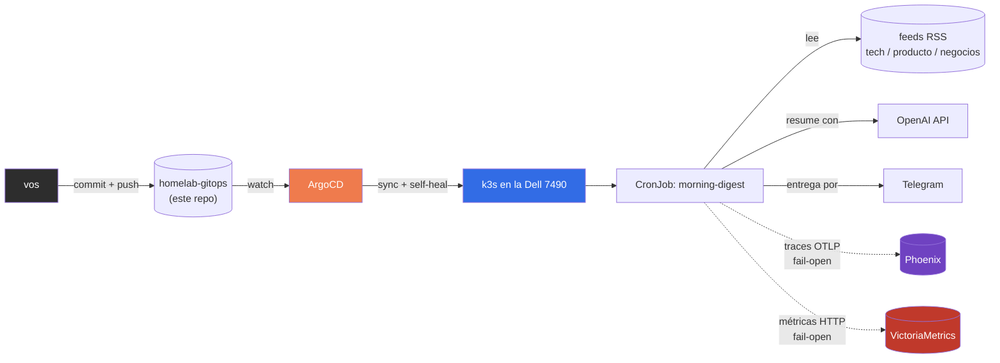
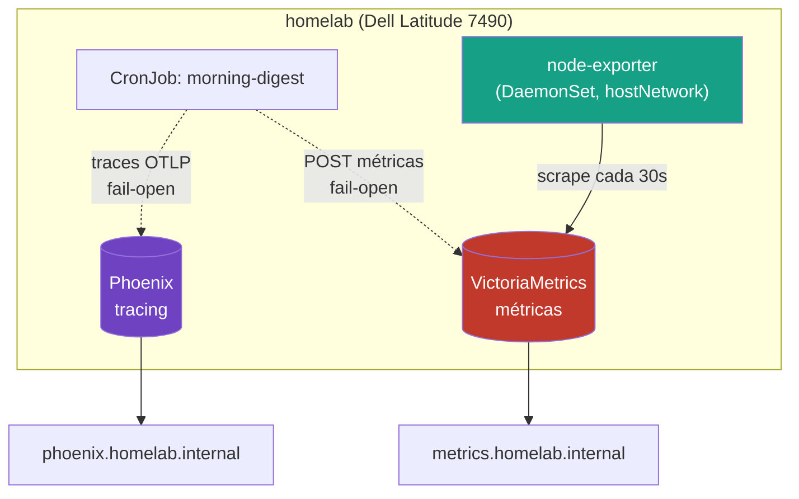

# homelab-gitops

> Una notebook que juntaba polvo con la batería fundida, convertida en un
> cluster Kubernetes gobernado 100% por Git. Nada se toca a mano en el
> cluster: si algo cambia, cambia acá, se hace commit, y ArgoCD lo aplica
> solo.

|  |  |
|---|---|
| **Hardware** | Dell Latitude 7490 (i5 8va gen, 16GB RAM, sin GPU, sin batería — vive enchufada) |
| **SO** | Debian 13, mínimo, sin entorno gráfico |
| **Orquestador** | k3s (un solo nodo) + ArgoCD (self-heal on) |
| **Regla de oro** | Los cerebros van por API (OpenAI/Claude), el fierro local solo orquesta |
| **Agentes corriendo** | 2 — `morning-digest`, `watchdog` |
| **Observabilidad** | Phoenix (tracing) + VictoriaMetrics (métricas) + node-exporter (salud del node) — las tres, fail-open |
| **Red** | Pi-hole — DNS de toda la LAN, con bloqueo de ads/tracking a nivel de red |
| **Acceso remoto** | Tailscale (mesh WireGuard) — homelab, desktop y celular en el mismo tailnet, SSH sin exponer puertos al router |

## El loop completo


```mermaid
flowchart LR
    Dev["vos"] -->|commit + push| Repo[("homelab-gitops\n(este repo)")]
    Repo -->|watch| ArgoCD
    ArgoCD -->|sync + self-heal| K3s["k3s en la Dell 7490"]
    K3s --> Cron["CronJob: morning-digest"]
    Cron -->|lee| RSS[("feeds RSS\ntech / producto / negocios")]
    Cron -->|resume con| LLM["OpenAI API"]
    Cron -->|entrega por| TG["Telegram"]
    Cron -.->|traces OTLP\nfail-open| Phoenix[("Phoenix")]
    Cron -.->|métricas HTTP\nfail-open| VM[("VictoriaMetrics")]

    style Dev fill:#2d2d2d,color:#fff
    style ArgoCD fill:#ef7b4d,color:#fff
    style K3s fill:#326ce5,color:#fff
    style Phoenix fill:#6f42c1,color:#fff
    style VM fill:#c0392b,color:#fff
```

Si alguien entra por SSH y edita algo con `kubectl` a mano, ArgoCD lo nota
y lo revierte. Ese es, literalmente, el punto de todo el ejercicio.

## Por qué existe esto

La 7490 tenía un problema simple: no arrancaba sin estar enchufada, y
estaba juntando polvo. Un server que vive enchufado 24/7 y no necesita
batería no es un defecto, es el caso de uso perfecto. La pregunta era qué
tan lejos se podía llevar esa máquina vieja como plataforma real de
aprendizaje — no un tutorial de juguete, sino la misma disciplina que usa
un equipo de infra en producción, comprimida en un solo nodo.

Un i5 de 8va gen con 16GB de RAM no compite con GPUs corriendo modelos
grandes, pero sobra y sobra para correr Kubernetes, ArgoCD, y agentes que
llaman a un LLM por HTTP y se apagan. Pelear esa batalla al revés (LLM
pesado local, orquestación mínima) hubiera sido jugar en contra del
hardware que hay.

## Qué hay corriendo acá

| Componente | Para qué |
|---|---|
| **k3s** | Kubernetes de un solo nodo, liviano, con Traefik y SQLite incluidos. Nada de etcd ni HA — no hace falta para un nodo. |
| **ArgoCD** | El corazón operativo. Vigila este repo y aplica cualquier cambio al cluster automáticamente, con self-heal activado. |
| **`agents/morning-digest`** | El primer agente real: un CronJob diario que lee feeds RSS (tech, producto, negocios), arma un resumen con OpenAI agrupado por tema, y lo manda por Telegram con formato (negritas, bullets, link a cada noticia). Además publica esos mismos items en [`digest-agent`](https://github.com/julianalvarez95/digest-agent) (un agente Eve en Vercel), que los sirve al [portfolio](https://github.com/julianalvarez95/portfolio-personal) — fail-open, igual que tracing/métricas: si digest-agent está caído no afecta la entrega por Telegram. Corre, resume, se apaga — nada queda vivo consumiendo RAM entre corrida y corrida. |
| **`agents/watchdog`** | El segundo agente: un CronJob cada 10 minutos que evalúa reglas de alerta (disco, memoria, load, salud de `morning-digest`) contra VictoriaMetrics y avisa por Telegram solo en cambios de estado reales — sin LLM, con máquina de estados propia (pending → firing, histéresis, dedup) para no mandar spam. |
| **`infra/phoenix`** | Tracing de cada corrida de agente: fetch de RSS → llamada a OpenAI (con tokens) → entrega a Telegram, como un único trace navegable de punta a punta. |
| **`infra/victoria-metrics`** | Métricas de costo (tokens), duración y heartbeat por agente, más scrape de la salud del node. Retención corta (10 días), pensada para los ~12Gi libres de disco que tiene la 7490. |
| **`infra/node-exporter`** | DaemonSet liviano que expone CPU/memoria/disco del node para que VictoriaMetrics los scrapee cada 30s — antes de esto, la única forma de ver esos números era `kubectl top`, sin historial. |
| **`infra/pihole`** | DNS de toda la LAN: el router reparte esta IP como DNS por DHCP, y Pi-hole filtra ads/tracking antes de reenviar a resolvers públicos (`1.1.1.1`, `9.9.9.9` — nunca el router, para no crear un loop). Solo DNS, sin DHCP propio — el router sigue asignando IPs. |

Ambas UIs de observabilidad (Phoenix y el `vmui` de VictoriaMetrics)
más el panel de Pi-hole quedan detrás de un `IngressRoute` de Traefik,
resueltos solo dentro de la LAN de casa (`phoenix.homelab.internal`,
`metrics.homelab.internal`, `pihole.homelab.internal`) — sin exposición
pública, sin TLS ni auth propios, mismo modelo de confianza que el
resto del cluster. La excepción es el propio puerto 53 de Pi-hole, que
sí necesita llegar a toda la LAN (no solo al cluster): se expone vía
`hostPort` en el Deployment en vez de `hostNetwork`, porque k3s ya usa
el 80/443 del node para Traefik y no hay MetalLB en este cluster.

Una vez que Pi-hole sea el resolver de la LAN, sus "Local DNS Records"
pueden servir los `*.homelab.internal` de arriba directamente — hoy
cada máquina de la LAN los resuelve vía una entrada manual en
`/etc/hosts`, un hack que Pi-hole puede retirar.


```mermaid
flowchart TB
    subgraph Node["homelab (Dell Latitude 7490)"]
        Cron["CronJob: morning-digest"]
        NodeExp["node-exporter\n(DaemonSet, hostNetwork)"]
        Phoenix[("Phoenix\ntracing")]
        VM[("VictoriaMetrics\nmétricas")]
    end

    Cron -.->|traces OTLP\nfail-open| Phoenix
    Cron -.->|POST métricas\nfail-open| VM
    NodeExp -->|scrape cada 30s| VM

    Phoenix --> PhoenixWeb["phoenix.homelab.internal"]
    VM --> VMWeb["metrics.homelab.internal"]

    style Phoenix fill:#6f42c1,color:#fff
    style VM fill:#c0392b,color:#fff
    style NodeExp fill:#16a085,color:#fff
```

Las líneas punteadas son a propósito: si Phoenix o VictoriaMetrics están
caídos, el agente loguea el error y sigue — la entrega del digest nunca
depende de que la telemetría esté arriba.

## Cómo se armó, en orden real

<details>
<summary><b>1. El sistema operativo</b> — por qué Debian y no otra cosa</summary>

Instalación mínima, sin entorno gráfico. Se evaluaron Ubuntu Server (de
más, con snapd y capas que no aportan nada acá), Fedora/openSUSE (ciclos
de release demasiado cortos para un server que se quiere dejar tranquilo)
y Arch (rolling release en una máquina desatendida es jugarse a que un
update rompa algo mientras dormís). Debian gana por aburrido, que es
exactamente lo que se necesita.
</details>

<details>
<summary><b>2. Acceso remoto, hecho bien</b> — SSH solo por clave</summary>

Se generó un par de claves ed25519 en el desktop, se copió la pública al
server, y recién después de confirmar que el login sin password
funcionaba se deshabilitó `PasswordAuthentication` — con dos terminales
abiertas en paralelo por las dudas, porque quedarse afuera de tu propio
server por un typo en `sshd_config` es un clásico.

También apareció el caso menos obvio: `UsePAM yes` puede dejar un bypass
de password vía `KbdInteractiveAuthentication` aunque
`PasswordAuthentication` esté en `no`. Se verificó explícitamente con
`ssh -o PubkeyAuthentication=no` para confirmar que de verdad rechazaba
sin clave.
</details>

<details>
<summary><b>3. Red, con IP que no se mueve</b></summary>

La 7490 arrancó por WiFi (funcional, pero no lo que se quiere para un
server 24/7), y después se le conectó un cable Ethernet. La interfaz
`enp0s31f6` no traía `dhclient` preinstalado en Debian 13 — se resolvió
con `isc-dhcp-client` — y se dejó la configuración persistente en
`/etc/network/interfaces` para que levante sola en cada boot. La IP quedó
reservada por MAC en el router (`Pre-assigned DHCP IP Addresses`), así la
dirección nunca cambia aunque el DHCP reinicie.
</details>

<details>
<summary><b>4. k3s y ArgoCD, en ese orden, desde el primer día</b></summary>

La tentación natural es instalar Kubernetes y empezar a tirar
`kubectl apply` a mano mientras "se prueban cosas". Se evitó eso a
propósito: ArgoCD se instaló antes del primer Deployment real, para que
el hábito de "todo pasa por Git" quedara fijado desde el arranque y no
como una migración incómoda después.

El primer test fue un nginx dummy — no porque nginx importe, sino para
confirmar el ciclo completo: commit → push → ArgoCD sincroniza →
`kubectl delete pod` a mano → el pod vuelve solo.
</details>

<details>
<summary><b>5. El primer agente real</b> — decisiones de diseño</summary>

Reemplazar el nginx de prueba por algo que efectivamente hace algo útil:
leer feeds, resumir con un LLM, mandar el resultado a Telegram.

- **Secrets fuera de Git.** Se evaluó SOPS+KSOPS para manejar secrets
  encriptados dentro del repo, pero para un solo CronJob con un puñado de
  variables es sobreingeniería. Se optó por crear el `Secret` de
  Kubernetes directo con `kubectl`, mientras el CronJob (que sí vive en
  Git) lo referencia por nombre. GitOps parcial, pragmático. Cuando haya
  tres o cuatro agentes con secrets distintos, ahí se justifica meter
  SOPS de una.
- **Build manual, no CI todavía.** La imagen se buildea a mano y se
  pushea a GitHub Container Registry. Suficiente para un agente. Cuando
  el ciclo de iterar-rebuildear-pushear empiece a cansar, se migra a
  GitHub Actions.
- **Gmail como fuente, probado y descartado.** La primera versión sumaba
  newsletters etiquetados en Gmail vía IMAP, pero el label de Gmail se
  trataba como si fuera literalmente una carpeta IMAP (`imap.select`),
  algo que no funciona en general para labels anidados. En vez de meterle
  la extensión `X-GM-LABELS` de Gmail para arreglarlo bien, se sacó la
  fuente entera — RSS solo, más feeds, resumen más largo y con links.
</details>

<details>
<summary><b>6. Observabilidad, en 3 fases</b> — tracing, métricas y salud del node</summary>

Con un solo agente en producción, la única forma de ver qué pasaba en
cada corrida era leer logs de Kubernetes a mano — y ya había pasado un
incidente real (el de arriba: el job terminaba `Completed`, exit 0, sin
mandar nada a Telegram). Antes de tocar código se escribió un documento
de diseño (`docs/superpowers/specs/2026-07-23-telemetria-design.md`),
en 3 fases con prioridad decreciente: debugging de agentes, costo de
LLM, salud del node.

**Arquitectura: dual-write directo, sin collector.** Se evaluó un OTel
Collector como hub central, pero suma un servicio persistente más en un
node que ya está ajustado de disco (12Gi libres). Cada agente exporta
directo a Phoenix (traces) y a VictoriaMetrics (métricas) al final de su
corrida — coherente con la regla de oro de este repo: el hardware local
solo orquesta, nada corre de más.

**Fase 1 — Phoenix.** El cliente de OpenAI queda auto-instrumentado vía
OpenInference (tokens de prompt/completion incluidos gratis), más spans
manuales para el fetch de RSS y la entrega a Telegram, todos anidados
bajo un span raíz por corrida — así una corrida completa es un trace
navegable de punta a punta, no 3 traces sueltos. Regla no negociable:
la telemetría tiene que fallar en modo abierto (*fail open*) — si
Phoenix está caído, se loguea el error y el digest se manda igual.

**Fase 2 — VictoriaMetrics.** Al final de cada corrida, el agente
reporta éxito/fracaso, duración, tokens usados y un timestamp de
heartbeat. El detalle que importa: el reporte de éxito vive en un
`try/finally` que envuelve *toda* la corrida, no solo el camino feliz
— si no fuera así, el métrico de éxito nunca podría registrar una
falla real, que es justamente para lo que existe.

**Fase 3 — node-exporter.** DaemonSet liviano, sin PVC propio,
scrapeado por VictoriaMetrics cada 30 segundos. Acá el patrón se
invierte: en vez de que el agente empuje datos (como en las Fases 1 y
2), es VictoriaMetrics quien va a buscarlos — porque node-exporter es
un proceso persistente, no un CronJob efímero.
</details>

<details>
<summary><b>7. Pi-hole</b> — DNS de toda la LAN, no solo del cluster</summary>

Hasta acá todo lo que corre en el cluster se consume solo desde adentro
de la LAN vía `IngressRoute` — pero DNS es distinto: tiene que llegar a
*cada* dispositivo de la red, no solo a quien le apunte a un hostname
`*.homelab.internal`.

**Por qué `hostPort` y no `hostNetwork`.** k3s ya usa el 80/443 del
node para Traefik, y no hay MetalLB en este cluster (ningún Service
`LoadBalancer` en todo el repo). Con `hostNetwork: true` el pod de
Pi-hole heredaría la red del node entera y su panel web (puerto 80)
chocaría con Traefik. La solución fue exponer *solo* el puerto 53
(TCP+UDP) al host vía `hostPort` en el Deployment, dejando el panel web
como cualquier otro servicio del repo: ClusterIP + `IngressRoute`.

**Nunca el router como upstream.** `FTLCONF_dns_upstreams` apunta
directo a `1.1.1.1`/`9.9.9.9`. Apuntar al router hubiera cerrado un
loop (router → Pi-hole → router) que tumba la resolución DNS de toda la
casa apenas alguien lo prueba.

Dos bugs reales aparecieron recién al probar desde otro dispositivo de
la LAN (ver tabla de baches abajo): `ufw` bloqueando el tráfico
reenviado (`FORWARD`, no `INPUT`) hacia el pod, y FTL ignorando
consultas que no vinieran de la subnet del propio CNI. Ninguno de los
dos aparece probando desde el mismo node — hace falta un segundo
dispositivo en la LAN para verlos.

**Verificado end-to-end:** con el router (Technicolor DPC3848VE)
repartiendo `192.168.0.214` como DNS por DHCP, un dispositivo real de
la LAN resuelve dominios normales y bloquea dominios de tracking
conocidos (`doubleclick.net` → `0.0.0.0`). El dashboard de Pi-hole
muestra IPs de cliente distintas por dispositivo en vez de una sola IP
genérica — confirma que el `hostPort` no está enmascarando el origen
real de las consultas.
</details>

<details>
<summary><b>8. El segundo agente: watchdog</b> — alertas proactivas, no un chatbot</summary>

Con un solo agente (`morning-digest`) y observabilidad completa, la
pregunta natural era qué hacer con el resto de la 7490. Se descartaron
un bot conversacional y RAG por no aportar disciplina nueva; se eligió
en cambio un **watchdog**: un agente que vigila las métricas que ya
existen y avisa por Telegram solo cuando algo cambia de estado de
verdad — el objetivo explícito era aprender alerting real (umbrales,
histéresis, deduplicación, evitar spam), no solo mover datos de un
lado a otro.

- **CronJob con máquina de estados propia, no vmalert+Alertmanager.**
  Un stack estándar hubiera resuelto esto con menos código, pero
  también hubiera escondido justo la parte que se quería aprender.
  vmalert+Alertmanager queda como camino de graduación futuro cuando
  el número de reglas crezca (~8-10).
- **Sin LLM.** El texto de cada alerta es un template fijo por regla —
  determinístico, nada que pueda fallar o alucinar justo cuando todo lo
  demás ya está roto. "Watchdog" vigila al agente LLM (`morning-digest`),
  no llama a uno.
- **Estado en VictoriaMetrics, no un PVC nuevo.** Reusa la infra que ya
  existe (el disco es la restricción más ajustada del node) y de yapa
  da gráficos de historial de alertas gratis en `vmui`.
- **Tres estados por regla:** `0` inactivo, `1` pending (condición
  verdadera pero todavía no confirmada), `2` firing. Pasar de `1` a `2`
  exige que la condición siga verdadera en la corrida siguiente
  (`for_seconds`, ~10 min para las reglas de disco/memoria/load) —
  eso es la histéresis, para no alertar por un pico de un segundo.
  Mientras el estado se mantiene en `2` no se vuelve a notificar (el
  dedup), y si nunca pasó de `1` la resolución es silenciosa: no se
  había avisado nada, así que tampoco hay nada que resolver en voz alta.
- **Lecturas fail-closed, escrituras fail-open.** Si falla el *push* de
  una métrica se loguea y se sigue (mismo criterio que el resto del
  repo). Pero si falla la *lectura* del estado previo de una regla, esa
  regla se saltea esa corrida entera en vez de asumir "inactivo" —
  asumir inactivo con VictoriaMetrics caída convertiría justo esa caída
  en una ráfaga de falsos positivos, el spam que este agente existe
  para evitar.
- **Código de Telegram/métricas duplicado a propósito, no compartido.**
  `watchdog` copia `send_telegram`, `sanitize_telegram_html` y
  `push_metrics` casi textual desde `morning-digest` en vez de extraer
  un módulo común — dos agentes no justifican esa capa. El disparador
  para extraer `agents/_shared/` queda en el tercer agente, documentado
  en `CLAUDE.md`.

Verificado en vivo contra el cluster real: se forzó el umbral de
`disk_low` a un valor absurdo, se dispararon corridas manuales, y se
confirmó la secuencia completa `0 → 1 → 2 (FIRING, un solo mensaje) →
2 (sin renotificar) → 0 (RESOLVED)` en Telegram y en los gráficos de
`vmui`, antes de revertir el umbral a su valor real.
</details>

<details>
<summary><b>9. Tailscale</b> — acceso remoto entre homelab, desktop y celular, sin exponer nada al router</summary>

Hasta acá el acceso a la 7490 dependía de estar en la misma LAN (SSH por
IP local) o de exponer puertos en el router — ninguna de las dos escala
bien para conectar el desktop y el celular desde fuera de casa.
Tailscale arma una mesh WireGuard entre los tres dispositivos, cada uno
con una IP fija en `100.64.0.0/10` (CGNAT), sin abrir nada hacia
internet.

**Verificado antes de instalar: no choca con Pi-hole.** Pi-hole corre en
el cluster, no como servicio nativo del host — el `Deployment` expone el
53 vía `hostPort` (ver sección 7), que Kubernetes implementa como DNAT
de iptables, no como un socket real del host. `ss -tuln | grep :53` no
muestra ningún proceso escuchando a nivel de host, así que el `tailscaled`
del homelab no compite por el puerto. De yapa, Tailscale suma una
interfaz más (`tailscale0`) por la que Pi-hole podría eventualmente
servir DNS también a dispositivos remotos — pendiente de decidir si se
configura el "Global nameserver" del tailnet apuntando a la IP Tailscale
del homelab.

**Instalación, igual en las tres máquinas Linux/homelab y desktop:**

```bash
curl -fsSL https://tailscale.com/install.sh | sh
sudo tailscale up --ssh
```

`--ssh` habilita el SSH nativo de Tailscale (autenticado por identidad
del tailnet, no por clave), sumado al SSH por clave que ya existía
(sección 2) — no lo reemplaza. En el celular fue instalar la app oficial
de la App Store y loguear con la misma cuenta.

**MagicDNS**, activado después desde el panel de admin
(`login.tailscale.com/admin/dns`), resuelve el nombre de cada dispositivo
sin tocar nada en las máquinas: `ssh usainbot@homelab` en vez de
`ssh usainbot@100.102.169.46`.
</details>

## Los baches, porque son la parte que vale la pena releer

Nada de esto salió andando a la primera, y está bien que así sea:

| Bache | Qué pasó en realidad | Cómo se resolvió |
|---|---|---|
| **CRD de ArgoCD no aplicaba** | `kubectl apply` excedía el límite de 256KB de la annotation `last-applied-configuration`. | `--server-side --force-conflicts`, que no depende de esa annotation. |
| **`k3s kubectl` ignoraba `~/.kube/config`** | A diferencia de `kubectl` normal, iba directo a `/etc/rancher/k3s/k3s.yaml` (permisos solo root). | Exportar `KUBECONFIG` explícitamente antes de cada comando. |
| **`openai==1.54.0` tiraba `TypeError` sobre `proxies`** | `httpx` no estaba pinneado, `pip` instaló la última versión, que había sacado ese parámetro interno. | Pinnear `httpx==0.27.2`. Recordatorio permanente: pinnear versiones, siempre. |
| **El job corría `Completed`, exit 0, pero no llegaba nada a Telegram** | El script ignoraba silenciosamente cualquier error de la API de Telegram. Al agregar logging + `raise_for_status()`, apareció el problema real: el token tenía el prefijo `bot` duplicado (`botbot123:...`), tal cual lo entrega BotFather si lo copiás del mensaje de confirmación. | Se corrigió el dato **y** el código ahora tolera el prefijo con `.removeprefix("bot")`, para que el mismo error humano no vuelva a romper nada. |
| **La fuente de Gmail "andaba" pero no traía nada útil** | El label se resolvía como carpeta IMAP literal, sin verificar si el `select` había funcionado — fallaba en silencio. | Se sacó la fuente en vez de arreglar el lookup: RSS ya cubre el caso de uso mejor. |
| **El instrumentador de OpenAI pedía una versión mucho más nueva** | `openinference-instrumentation-openai` exige `openai>=1.69.0` incluso en sus versiones más viejas — el repo tenía `openai==1.54.0` pinneado desde el incidente de `httpx` de la fila de arriba. | Subir `openai` a `1.99.9` (misma major version, sin saltar a la v2 del SDK) y revalidar que `httpx==0.27.2` seguía siendo compatible antes de dar por cerrado el cambio. |
| **El instrumentador crasheaba con un `TypeError` de `wrap_function_wrapper`** | `wrapt` sin pinnear resolvía a la versión 2.x, que cambió la firma que `openinference-instrumentation-openai==0.1.40` esperaba. | Pinnear `wrapt==1.17.3`. |
| **`PHOENIX_COLLECTOR_ENDPOINT` armaba una URL rota** | Sin el esquema `http://` explícito, Phoenix no podía inferir el protocolo de transporte y caía en silencio a HTTP con una URL malformada, en vez de gRPC. | Siempre `http://host:4317`, aunque el transporte real sea gRPC. |
| **El pod de Phoenix crasheaba al arrancar** | Kubernetes inyecta automáticamente una env var `PHOENIX_PORT="tcp://<ip>:6006"` en cualquier pod del namespace apenas existe un Service llamado `phoenix` — y Phoenix espera que esa variable sea un entero, no ese string. | Fijar `PHOENIX_PORT` y `PHOENIX_GRPC_PORT` explícitos en el Deployment, pisando el valor autogenerado. |
| **La UI de Phoenix no se veía desde otra máquina de la LAN** | `ufw` tiene política `DROP` por default y solo permitía explícitamente un puñado de puertos (SSH, 6443, 80, 443, 8080) — el 6006 del port-forward no estaba en la lista. | Resuelto de raíz con el `IngressRoute` de Traefik sobre el puerto 80 (ya permitido), en vez de abrir un puerto nuevo por cada UI. |
| **Un feed RSS cortó la conexión a mitad de una corrida** | `RemoteDisconnected` real — la primera falla que el tracing nuevo capturó en producción, visible como un span con `status_code: ERROR` y el stack trace completo en Phoenix, en vez de perderse en logs de Kubernetes. | Sin arreglar a propósito: quedó como el primer caso real que demuestra por qué vale la pena tener tracing desde el día uno. |
| **VictoriaMetrics "parece vacío" la mayor parte del día** | Con una sola muestra por corrida diaria, las queries instantáneas (incluida la que usa `vmui` por default) caen fuera del lookback de ~5 minutos y devuelven "sin datos", aunque la serie exista. | No es una falla: usar una query de rango (últimos 7 días) o `last_over_time(metric[25h])`. |
| **Pi-hole no resolvía nada desde otro dispositivo de la LAN** | El tráfico DNAT del `hostPort` (host → pod) pasa por la cadena `FORWARD` de iptables, no por `INPUT` — `ufw allow 53/tcp` y `ufw allow 53/udp` no alcanzan porque esas reglas solo cubren `INPUT`. `DEFAULT_FORWARD_POLICY="DROP"` en `/etc/default/ufw` descartaba todo. | `DEFAULT_FORWARD_POLICY="ACCEPT"` + `ufw reload`. Aceptable en un node de un solo cluster sin nada más ruteando detrás. |
| **Pi-hole seguía sin responder después de arreglar `ufw`** | El `dig` directo a la IP del pod funcionaba, pero desde la LAN seguía en timeout. El log de FTL lo decía explícito: `dnsmasq: ignoring query from non-local network 192.168.0.214` — el modo `listeningMode` default (`LOCAL`) solo responde a fuentes que la propia interfaz del pod reconoce como red local (la subnet del CNI), no la LAN real que llega vía `hostPort`. | `FTLCONF_dns_listeningMode=ALL`. Aceptable porque Pi-hole no tiene exposición pública, solo LAN. |
| **`watchdog` mandó un FIRING duplicado al probar la máquina de estados** | Dos corridas manuales disparadas ~15-17s aparte (mucho más pegadas que el schedule real de 10 min) pisaron el `-search.latencyOffset` de VictoriaMetrics (~30s): la segunda corrida leyó el estado *previo* a que la primera lo escribiera. No era un bug de la lógica de estados. | Nada que arreglar en el código — al cadence real de `*/10 * * * *` la ventana no aplica. Documentado en `CLAUDE.md` para no repetir el susto probando a mano. |
| **`tailscale up --ssh` se colgaba sin mostrar la URL de login en el desktop** | `tailscaled` quedaba reintentando `bootstrapDNS` contra varios hosts de DERP sin avanzar. `resolvectl status` mostró que Cloudflare WARP tenía el scope `+DefaultRoute` de DNS con un stub local (`127.0.2.2`/`127.0.2.3`), y `dig login.tailscale.com` devolvía IPs `192.200.0.x` — fake-IPs sintéticas de WARP, no la IP real del control plane de Tailscale. | `warp-cli disconnect` antes de `tailscale up --ssh`. Para correr ambos en simultáneo a futuro, excluir el rango CGNAT de Tailscale del túnel de WARP: `warp-cli tunnel host add 100.64.0.0/10`. |

Ninguno de estos errores fue exótico. Son los errores normales de armar
infraestructura real: límites de API mal documentados, defaults de
herramientas que cambian entre versiones, y un copy-paste de token con un
prefijo de más. La diferencia entre que esto ande o no es tener logging
que efectivamente diga qué pasó, en vez de asumir que "no tiró error"
significa "funcionó".

## Estructura del repo

```
homelab-gitops/
├── apps/                     # reservado para el patrón app-of-apps a futuro
├── agents/
│   ├── morning-digest/
│   │   ├── src/
│   │   │   ├── agent.py
│   │   │   └── requirements.txt
│   │   ├── Dockerfile
│   │   ├── feeds.yaml
│   │   ├── cronjob.yaml
│   │   └── kustomization.yaml
│   └── watchdog/
│       ├── src/
│       │   ├── agent.py
│       │   └── requirements.txt
│       ├── Dockerfile
│       ├── rules.yaml
│       ├── cronjob.yaml
│       └── kustomization.yaml
├── infra/
│   ├── phoenix/               # Fase 1: tracing
│   │   ├── deployment.yaml    # Deployment + Service + PVC
│   │   ├── ingress.yaml       # IngressRoute (phoenix.homelab.internal)
│   │   └── kustomization.yaml
│   ├── victoria-metrics/      # Fase 2: métricas de costo/heartbeat
│   │   ├── deployment.yaml    # Deployment + Service + PVC
│   │   ├── ingress.yaml       # IngressRoute (metrics.homelab.internal)
│   │   ├── scrape.yml         # scrape_config hacia node-exporter
│   │   └── kustomization.yaml
│   ├── node-exporter/         # Fase 3: salud del node
│   │   ├── daemonset.yaml     # DaemonSet + Service
│   │   └── kustomization.yaml
│   └── pihole/                # DNS de toda la LAN
│       ├── deployment.yaml    # Deployment (hostPort 53) + Service + PVC
│       ├── ingress.yaml       # IngressRoute (pihole.homelab.internal)
│       └── kustomization.yaml
└── docs/
    └── superpowers/specs/     # specs de diseño (ej. telemetría)
```

Las `Application` de ArgoCD para `infra/*` no viven en este repo — se
aplican a mano con `kubectl`, mismo patrón que `morning-digest`
(`syncPolicy.automated.{prune,selfHeal}` + `CreateNamespace=true`). Es
la misma decisión de "GitOps parcial, pragmático" que ya se tomó con
los secrets.

## Qué sigue

- [x] Timezone del sistema fijado a `America/Argentina/Buenos_Aires` para
      que el CronJob dispare a la hora real esperada, no en UTC.
- [x] Observabilidad (`infra/phoenix`, `infra/victoria-metrics`,
      `infra/node-exporter`): tracing de cada corrida de agente
      (Phoenix), métricas de costo/heartbeat por agente y salud del
      node (VictoriaMetrics), todo fail-open — si la telemetría está
      caída, el agente entrega igual. Detalle completo en
      `docs/superpowers/specs/2026-07-23-telemetria-design.md`.
- [x] `infra/pihole`: DNS de toda la LAN con bloqueo de ads/tracking,
      solo DNS (sin DHCP propio, el router sigue asignando IPs).
- [x] `agents/watchdog`: segundo agente, alertas proactivas sobre disco,
      memoria, load y salud de `morning-digest`, con máquina de estados
      propia (pending → firing, histéresis, dedup) y sin LLM. Verificado
      en vivo contra el cluster real.
- [x] Tailscale: mesh WireGuard entre homelab, desktop y celular, con
      SSH nativo (`--ssh`) y MagicDNS. Verificado sin conflicto con
      Pi-hole (el 53 del pod es `hostPort`/DNAT, no un socket del host).
- [ ] Decidir si el "Global nameserver" del tailnet apunta a la IP
      Tailscale del homelab, para que el bloqueo de Pi-hole aplique
      también al celular fuera de la LAN (datos móviles).
- [ ] Más agentes bajo `agents/`, cada uno con su propia carpeta,
      Dockerfile, y CronJob — el patrón ya está probado y se repite.
